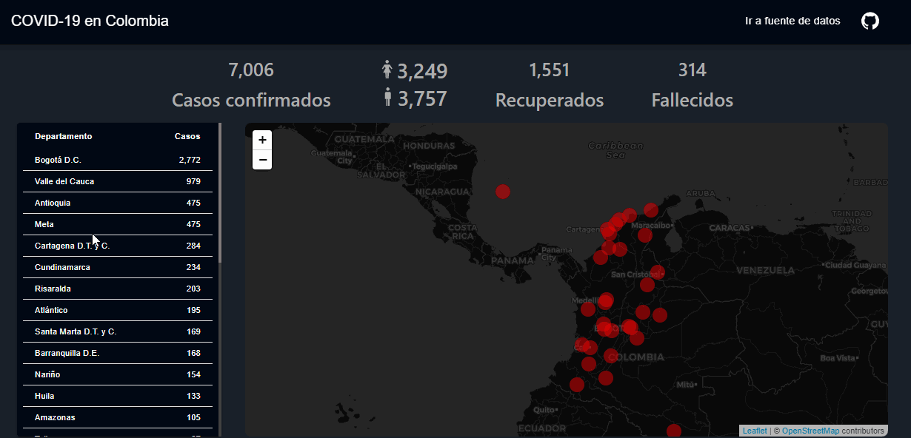

## Mapa del COVID-19 en Colombia

Contiene el consolidado de los casos positivos de Coronavirus COVID-19 en Colombia reportados por el Instituto Nacional de Salud (INS). Los datos se pueden ver en [COVID-19](https://www.datos.gov.co/Salud-y-Protecci-n-Social/Casos-positivos-de-COVID-19-en-Colombia/gt2j-8ykr)

**Nota: Para las ciudades que son distritos (Cartagena, Bogotá, Santa Marta, Buenaventura y Barranquilla), sus cifras son independientes a las cifras del departamento al cual pertecen, en concordancia con la división oficial de Colombia**

## Artículos para el desarrollo del proyecto

- [Build a COVID-19 Dashboard in Python with Plotly Dash](https://towardsdatascience.com/how-to-track-covid-19-cases-in-the-united-states-in-python-9b297ff9f6f5)
- [How to create a Coronavirus (COVID-19) Dashboard & Map App in React with Gatsby and Leaflet](https://www.freecodecamp.org/news/how-to-create-a-coronavirus-covid-19-dashboard-map-app-in-react-with-gatsby-and-leaflet/)
- [How to use React-Leaflet](https://blog.logrocket.com/how-to-use-react-leaflet/)
- [Creating a Bubbles Map using React-Leaflet](https://towardsdatascience.com/creating-a-bubbles-map-using-react-leaflet-e75124ca1cd2)

## Tecnología
- React

## Fuente de datos
- [Casos positivos de COVID-19 en Colombia](https://www.datos.gov.co/Salud-y-Protecci-n-Social/Casos-positivos-de-COVID-19-en-Colombia/gt2j-8ykr)

## Demo
